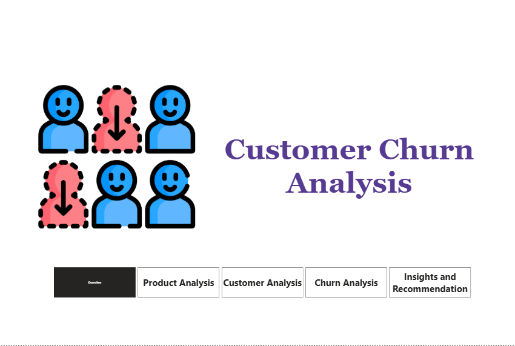
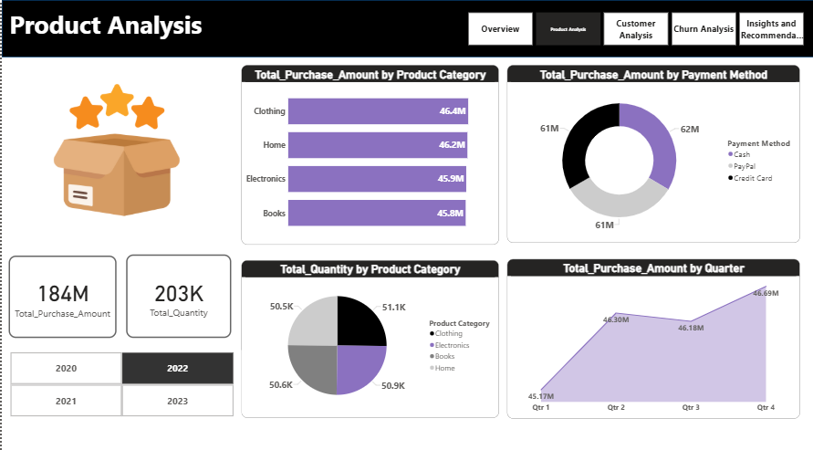
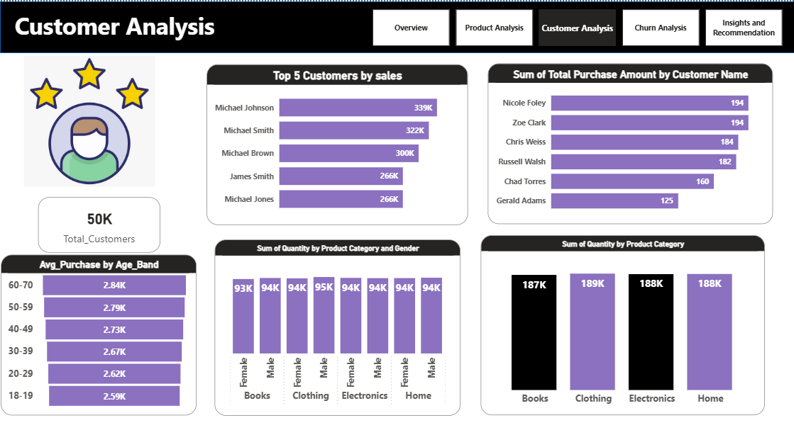
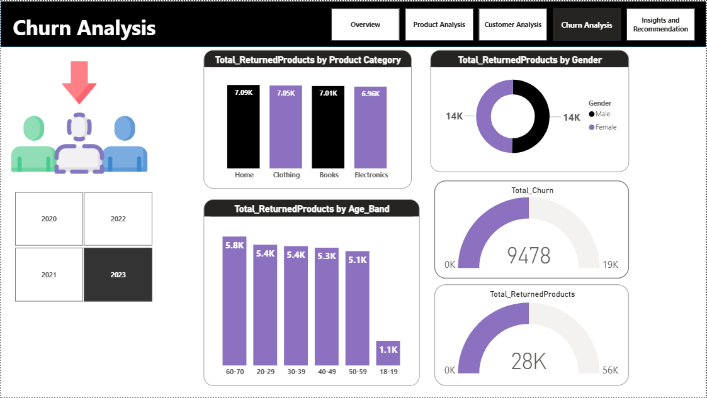
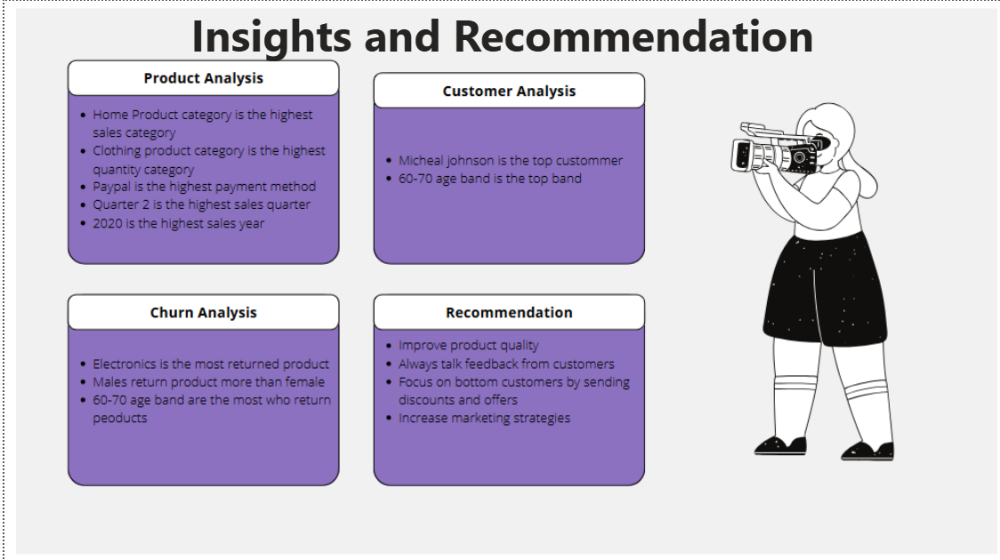

<div align="center">


<br/>


<br/>

> **Analyze. Segment. Retain.**
> A 5-page interactive Power BI dashboard analyzing customer churn, product performance, and purchase behavior across 50K customers and $184M in revenue.

<br/>


</div>

---

## Overview

This project analyzes customer churn, product performance, and purchase behavior for a retail business with 50K customers and $184M in total revenue across 2020–2023. The dashboard covers product analysis, customer segmentation, churn behavior, and actionable recommendations.

---

## Dashboard Pages

### Overview
Introduction page with navigation to all dashboard sections.



---

### Product Analysis
Revenue and quantity breakdown by product category, payment method, and quarter.



**Key findings:**
- Total Purchase Amount: **$184M** | Total Quantity: **203K**
- Clothing leads in purchase amount at **$46.4M**
- PayPal is the most used payment method
- Q4 is the highest sales quarter at **$46.69M**
- 2020 is the highest sales year

---

### Customer Analysis
Customer segmentation by age band, gender, and purchase behavior.



**Key findings:**
- Total Customers: **50K**
- Top customer: **Michael Johnson** with **$339K** in purchases
- Age band **60–70** has the highest average purchase at **$2.84K**
- Purchase quantity is evenly distributed across genders and categories

---

### Churn Analysis
Returned products and churn behavior breakdown by category, age band, and gender.



**Key findings:**
- Total Churn: **9,478** | Total Returned Products: **28K**
- **Electronics** has the highest return rate
- **Males** return more products than females
- Age band **60–70** are the most frequent returners

---

### Insights & Recommendations
Consolidated insights and actionable recommendations across all sections.



**Recommendations:**
- Improve product quality especially in Electronics
- Collect customer feedback regularly
- Target bottom customers with discounts and offers
- Increase marketing strategies to reduce churn

---

## Tech Stack

| Tool | Usage |
|------|-------|
| Power BI Desktop | Dashboard design & visualization |
| DAX | Calculated measures & KPIs |
| Excel | Data exploration & cleaning |

---

## Project Structure

```
Customer-Churn-Analysis/
├── customer_churn.pbix    # Main Power BI file
├── overview.png           # Dashboard page 1
├── product.png            # Dashboard page 2
├── customer.png           # Dashboard page 3
├── churn.png              # Dashboard page 4
└── insights.png           # Dashboard page 5
```

---

## Author

**Hager Bayoumi** — Data Scientist & ML Engineer

[](https://linkedin.com/in/hagar-mohamed-9bb768261)
[](https://github.com/hagerbayoumi11)
[](mailto:hagerbayoumi11@gmail.com)

<div align="center">

</div>
